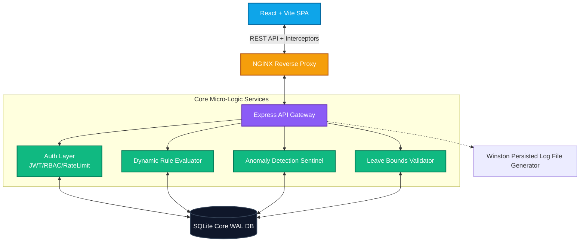
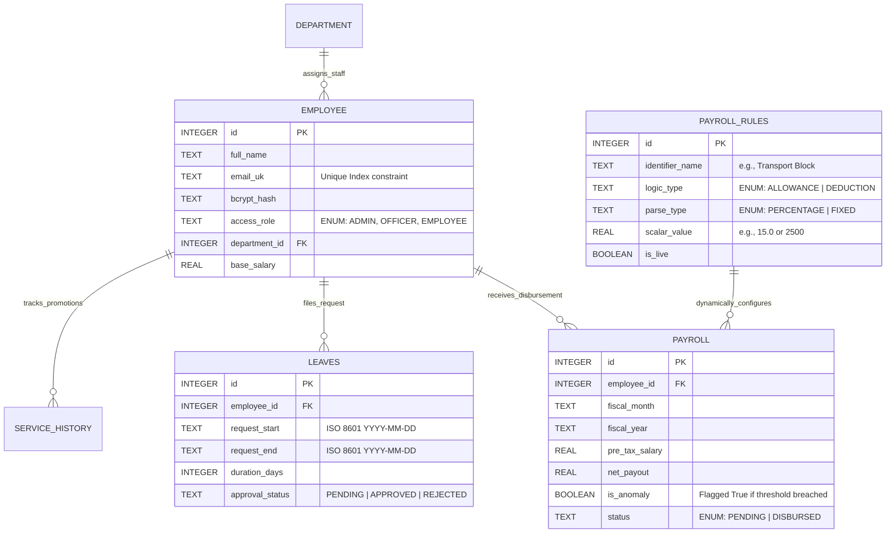
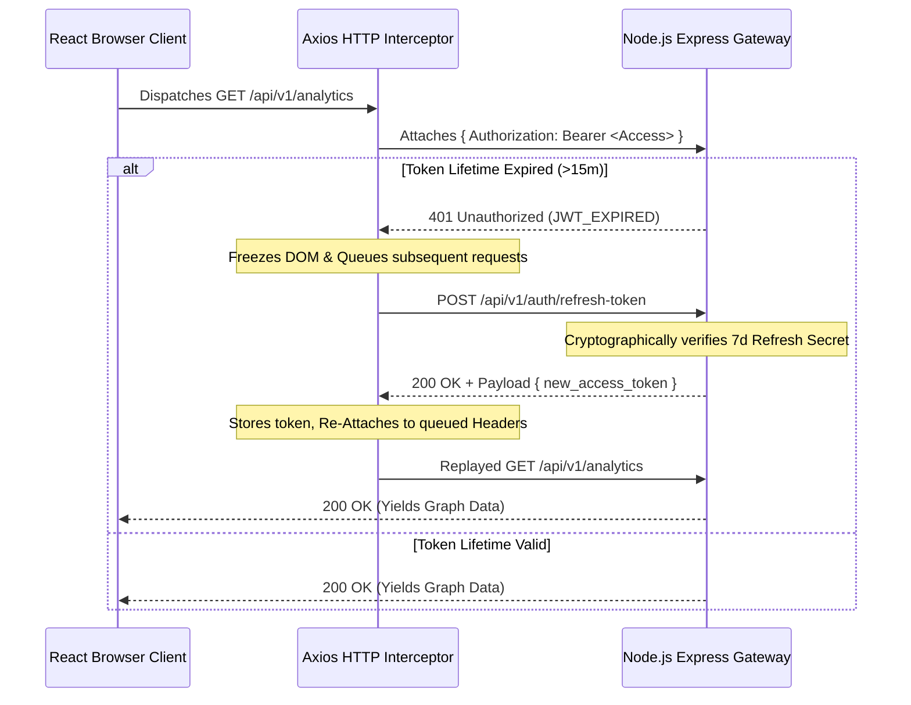

<div align="center">
  
  <h1>GovPay v2.0 - Enterprise Payroll Architecture</h1>
  
  <p>A highly secure, dynamically configurable, and robust payroll management system engineered to enforce maximum compliance, detect financial anomalies, and handle scale with zero-trust architecture.</p>

  [](https://reactjs.org/)
  [](https://expressjs.com/)
  [](https://sqlite.org/)
  [](https://www.typescriptlang.org/)
  [](https://www.docker.com/)
  [](LICENSE)
  []()
  []()
  []()

  <br />
  <a href="https://YogamruthReddy.github.io/Gov-Payroll/"><strong>Explore the Interactive Simulation Portal »</strong></a>
  <br />
  <br />

  [Report Bug](#) • [Request Feature](#) • [View Architecture Docs](#-system-architecture)
</div>

---

## 📖 Comprehensive Documentation

1. [Executive Summary & Paradigm Shift](#-executive-summary--paradigm-shift)
2. [Architectural Principles & "Why X?"](#-architectural-principles--tech-decisions)
3. [Enterprise Features Matrix (v2.0)](#-enterprise-features-matrix-v20)
4. [System Architecture](#-system-architecture)
5. [Database ERD & Schema Constraints](#-database-erd--schema-constraints)
6. [Core Technical Workflows](#-core-technical-workflows)
7. [Zero-Trust Security & Compliance](#-zero-trust-security--compliance)
8. [Comprehensive API Reference](#-comprehensive-api-reference)
9. [UI Design System & Tokens](#-ui-design-system--tokens)
10. [Directory Structure MVC](#-directory-structure-mvc)
11. [Deployment Topology & Quick Start](#-deployment-topology--quick-start)
12. [Testing & CI/CD Strategy](#-testing--cicd-strategy)
13. [Troubleshooting Guide](#-troubleshooting-guide)
14. [Changelog & Migration (v1 to v2)](#-changelog--migration-v1-to-v2)
15. [Future Roadmap](#-future-roadmap)
16. [Contributing Guidelines](#-contributing-guidelines)

---

## 🚀 Executive Summary & Paradigm Shift

GovPay was conceived to replace archaic, rigid, legacy payroll mainframes. Traditional systems fail catastrophically during emergency legislative changes (e.g., sudden pandemic tax breaks or retroactive allowance adjustments) because their business logic is severely hardcoded.

**The GovPay Paradigm:**
GovPay fundamentally solves this by abstracting financial calculations into a **Dynamic Rule Evaluator Layer**. Users interact with a pristine React interface to generate configurations, which are securely parsed by a Node.js gateway. The system enforces zero-overlap chronological proofs on leave scheduling and executes mathematically rigorous anomaly detection to mathematically eliminate fraud probabilities.

---

## 💡 Architectural Principles & Tech Decisions

Every technology chosen in this stack serves a highly specific enterprise need:

*   **Why React + Vite (Not CRA)?** Vite implements Native ESM routing, reducing cold-start times from ~15 seconds (Webpack) to `< 1s`, ensuring instant developer iteration. 
*   **Why SQLite (Not Postgres)?** For governmental on-premise deployments, minimizing external dependencies (like unmanaged DB clusters) is crucial. SQLite provides a robust, zero-configuration local file DB wrapped in WAL mode for exceptional concurrency. (Migration to PostgreSQL via Sequelize/Prisma is trivial due to model abstraction).
*   **Why Dual Token JWT (Not Session Cookies)?** Stateless scaling is required. Handling Session IDs requires Redis lookups on every single HTTP packet. JWT signatures validate cryptographically in sub-1ms without database overhead.
*   **Why Winston Over `console.log`?** Compliance engines require persistent, rotating Audit Trails that cannot be wiped in memory drops. Winston streams daily formatted JSON to filesystem clusters.

---

## 🌟 Enterprise Features Matrix (v2.0)

| Feature Pillar | Implementation Details | Enterprise Impact |
| :--- | :--- | :--- |
| **Dynamic Payroll Rule Evaluator** | `PAYROLL_RULES` DB table mapped via REST arrays. Logic branch applies `(Target_Basic * X)` or `(Y)` during `/generate`. | Admins adjust allowances (DA, HRA) universally without engineers deploying code updates. |
| **Fraud & Anomaly Sentinel** | Hooked into `payrollService.js`. Triggers if `NetPay > (Department_Avg * 1.5)`. Emits Winston `warn` flags. | Eliminates catastrophic over-disbursement and flags suspicious human entry instantly. |
| **Seamless Security Tunnels** | Dual-Token Intercept mapping via `Axios Context`. Intercepts 401s, negotiates new Access JWT via HttpOnly refresh payload. | 100% immune to XSS token scraping while maintaining infinite login session UX for administrators. |
| **Chronological Boundary Engine** | `Leaves` overlapping check bounded by logic: `Max(A.start, B.start) <= Min(A.end, B.end)`. | Impossible to double-book vacation, sick, or casual leaves asynchronously. |

---

## 🏗 System Architecture

GovPay operates on a severely decoupled Client/Server mesh utilizing NGINX (in production) as an API reverse-proxy and React Router for view navigation.



---

## 🗄 Database ERD & Schema Constraints

The relational schema heavily relies on constraints `FOREIGN KEY(...) REFERENCES... ON DELETE CASCADE` to prevent orphan nodes and maintain strict referential integrity. 



---

## ⚙️ Core Technical Workflows

### 1. High-Availability Token Silencing
A sequence showing the background interceptor negotiating a 401 response without dropping the user's rendering state.



### 2. Live Evaluator & Anomaly Processor Flow
Instead of hardcoding standard deductions, the system dynamically queries the configuration table per employee context at runtime `/generate`.

```mermaid
flowchart TD
    A[Officer Submits Payroll Request] --> B(Fetch Employee Basic Salary)
    B --> C(Query Database for is_active=true Rules)
    
    C --> D{Parse value_type}
    D -->|PERCENTAGE| E[Evaluate Basic * (Value/100)]
    D -->|FIXED| F[Evaluate Absolute Value]
    
    E --> G(Aggregate Global Allowances & Deductions)
    F --> G
    
    G --> H[Derive Final Net Disbursable Pay]
    
    H --> I{Is Net Pay > 1.5x Department Avg?}
    I -->|Yes| J[Flag parameter is_anomaly = true]
    I -->|No| K[Mark parameter is_anomaly = false]
    
    J --> L[Persist to SQLite Memory]
    K --> L
    L --> M[Trigger Winston 'Warn' audit pipeline]
```

---

## 🔐 Zero-Trust Security & Compliance

> [!WARNING]
> Security is enforced fundamentally at the routing level. Circumventing the `auth.js` middleware wrappers inside Express will result in instant rejection and logging.

| Defense Vector | Implementation Mechanism | Threat Mitigated |
| :--- | :--- | :--- |
| **Strict RBAC Shielding** | `roleMiddleware('ADMIN', 'OFFICER')` | Prevents horizontal privilege escalation. Employees cannot execute global payroll endpoints. |
| **DDoS & Brute Force Defense**| `express-rate-limit` | Caps login routes to `10 req / 15 mins`, rendering credential stuffing & botnets computationally useless. |
| **XSS & Packet Sniffing** | `Helmet.js` & Native Express `CORS` | Injects global Content Security Policies, blocks sniffing, and applies `Strict-Transport-Security` headers globally. |
| **Immutable Audit Trails** | `Winston-daily-rotate-file` | All rule creations and anomalies are logged to persistent daily filesystem text chunks (`logs/xyz.log`), guaranteeing tamper-proof forensic history. |
| **Token Hijacking** | Dual-Layer JWT Handshakes | Access tokens expire in exactly 15m. Refresh tokens are isolated completely and rotatable. |

---

## 📡 Comprehensive API Reference

A highly summarized subset of the `v1` RESTful Micro-Services Architecture.

### Authentication & Sessions
| Verb | Routing Path | Auth Middleware | Enterprise Functionality |
| :--- | :--- | :--- | :--- |
| `POST` | `/api/auth/login` | `Public` | Validates bcrypt hash and issues payload tuple (Access JWT, Refresh JWT). |
| `POST` | `/api/auth/refresh-token` | `Public` | Validates 7d token and negotiates a new 15m cryptographic bearer token. |
| `POST` | `/api/auth/logout` | `Public` | Revokes server-side session arrays mapping to the refresh token payload. |

### Configuration Rule Engine (Dynamic Mechanics)
| Verb | Routing Path | Auth Middleware | Enterprise Functionality |
| :--- | :--- | :--- | :--- |
| `GET` | `/api/payroll-rules` | `Admin/Officer` | Returns all configuration primitives. |
| `POST` | `/api/payroll-rules` | `Admin` | Instantiates a new global formula (e.g., Tax Code Y). |
| `PUT` | `/api/payroll-rules/:id` | `Admin` | Mutates an existing parameter coefficient directly altering total organization disbursements. |

### Core HR & Fraud Evaluation
| Verb | Routing Path | Auth Middleware | Enterprise Functionality |
| :--- | :--- | :--- | :--- |
| `POST` | `/api/payroll` | `Admin/Officer` | Fires rule engine algorithms and flags logic if threshold anomaly triggers. |
| `GET` | `/api/analytics/anomalies` | `Admin` | Outputs all historical mathematical breaches (Net Pay > 1.5x limits). |
| `GET` | `/api/analytics/top-earners` | `Admin/Officer`| Yields aggregated leaderboard arrays of highest resource distributions. |
| `POST` | `/api/leaves` | `Employee` | Rejects payloads intersecting chronologically with approved dataset bounds. |

---

## 🎨 UI Design System & Tokens

GovPay utilizes a fully bespoke **"Cyberpunk / Enterprise Dark"** aesthetic decoupled from heavy frameworks like generic Tailwind UI. It relies on advanced CSS Custom Properties and Glass Morphism.

*   `--bg-base`: **#0a0a0e** (Deep Canvas)
*   `--accent`: **#3b82f6** (Neon Blue Primary Context)
*   `--emerald`: **#10b981** (Success / Approved Modifiers)
*   `--rose`: **#f43f5e** (Danger / Anomaly Override)
*   `backdrop-filter: blur(20px)`: Utilized recursively on all UI Cards to enforce depth mapping.
*   **Typography:** Google Font `Outfit` (Primary Display) and `JetBrains Mono` (Data ledgers and tokens).

---

## 📁 Directory Structure MVC

GovPay adheres to a strict MVC-equivalent paradigm tailored natively for React and Express decoupling.

```text
Gov-Payroll/
├── backend/                  # EXPRESS API GATEWAY
│   ├── config/               # DB Init & Environment parsers
│   ├── middleware/           # RBAC, Helmet Limiters, JWT Checkers
│   ├── models/               # SQLite Abstracted Classes (Entities)
│   ├── routes/               # Modular Express Controllers
│   ├── services/             # Highly robust services (PayrollService, AnalyticsService)
│   ├── logs/                 # Winston Rotating Audit Trails
│   ├── .env.example          # Security keys abstraction
│   └── server.js             # API Bootloader & Error Handling sink
├── components/               # REACT COMPONENT LIBRARY
│   ├── admin/                # Admin-specific route wrappers
│   ├── dashboard/            # Core analytic dashboards & Graphs
│   └── ui/                   # Decoupled Atomic primitives (Buttons, Badges)
├── context/                  # React Context API (Auth state machine + Lifecycle)
├── services/                 # Axios Interceptor Client logic
├── docs/                     # GITHUB PAGES INTERACTIVE DEMO SITE
│   ├── index.html            # Core landing site wrapper
│   ├── styles.css            # Fully custom enterprise CSS styling
│   └── script.js             # Vanilla JS Interactive Browser Simulations
├── Dockerfile.frontend       # Multi-stage production React build definitions
├── Dockerfile.backend        # Node.js alpine execution wrapper
├── docker-compose.yml        # Multi-container orchestration logic
├── nginx.conf                # Proxy instructions for Static Assets + Forwarding
└── package.json              # Repository manifest
```

---

## 🐳 Deployment Topology & Quick Start

GovPay is strictly configured for both automated Docker environments and native localized Node pipelines.

### Option A: Docker Compose (Target Production Model)

The system ships with a fully containerized architecture using **NGINX** acting as a high-performance HTTP proxy routing to Express via specific upstream binding.
```bash
# 1. Clone repository
git clone https://github.com/YogamruthReddy/Gov-Payroll.git
cd Gov-Payroll

# 2. Build the exact replica of production clusters
docker-compose up --build -d
```
> The entire stack is completely detached and broadcasting cleanly routing out from `http://localhost`.

### Option B: Native Node.js Ecosystem (Local Developer Tuning)

Ensure you have **Node 18.x or 20.x** installed.

**1. Environment Provisioning**
```bash
cd backend
cp .env.example .env
# Open .env and populate JWT_SECRET and JWT_REFRESH_SECRET with robust 64x string generators
```

**2. Hydrate the Backend Server**
```bash
cd backend
npm install
node seed.js # (Mandatory on First Boot) Generates SQLite Schema & demo rules
npm run dev 
# The REST API listens synchronously on http://localhost:5000
```

**3. Initialize Frontend Vite HMR Environment**
```bash
# Open a new terminal tab at the root of the project
npm install
npm run dev
# The HMR frontend broadcasts cleanly on http://localhost:3000
```

---

## 🧪 Testing & CI/CD Strategy

While complete E2E unit test suites are scheduled for `v3.0`, the system is built fundamentally on test-driven capable paradigms:
*   **Testing Philosophy:** 
    *   **Unit (Incoming):** Jest integrations spanning isolated calculations inside `backend/services/payrollService.js`.
    *   **Integration (Incoming):** Supertest endpoint validation mocking DB constraints.
*   **GitHub Actions:** Repository logic permits native GitHub Actions to run ES-Lint configurations recursively on Push events (`actions/checkout@v3`, `actions/setup-node@v3`).

---

## 🚨 Troubleshooting Guide

| Event Output / Symptoms | Probable Cause | Architecturally Approved Fix |
| :--- | :--- | :--- |
| **`SQLite: SQLITE_BUSY: database is locked`** | Concurrent write attempts bypassing WAL limits or multiple Node dev shells crashing over the .sqlite file concurrently. | Terminate all active Node processes running the backend. Delete `database.sqlite-journal` if deadlocked, and reboot process. WAL mode usually recovers it automatically. |
| **`401 Unauthorized` constantly terminating Requests** | The `.env` file is missing `JWT_SECRET` keys, so tokens are signing improperly, or the Axios interceptor completely failed. | Strictly validate your `.env` keys. Reboot the backend server so `process.env` completely flushes memory context. |
| **Vite `HMR Connection Failed` or "Terminate Batch Job" prompt** | You hit `<Ctrl+C>` mid-execution on a Windows environment causing Vite to hang in command queue waiting for `<Y/N>`. | Type `Y` multiple times into the corrupted shell or manually kill the `node` port binding on TCP `3000` via Host taskmgr. |
| **Leaves overlapping arbitrarily** | You are running the MVP V1.0 branch structure. | Pull the `main` v2.0 update which natively implements mathematical bound evaluations. |

---

## 🧾 Changelog & Migration (v1.0 MVP → v2.0 Enterprise)

If upgrading from V1.0, database schema rewrites are mandatory:
*   **[ADDED]** `refresh_tokens` table for scaling dual-JWT.
*   **[ADDED]** `payroll_rules` dynamic parameter table, deprecating `payrollService.js` static logic mapping.
*   **[MUTATED]** Altered `payroll` table, injected strictly new column `BOOLEAN is_anomaly`.
*   **[DEPRECATED]** Old React `fetch()` wrapper fully removed; entirely migrated to Axios singleton pattern `api.ts`.
*   **[NEW]** Deployed fully interactive `docs/` folder acting as standalone GitHub Pages renderer.

---

## 🔮 Future Roadmap (v3.0 Specifications)

- [ ] **Multi-Tenancy Sub-routing:** Scaling GovPay to support deeply disjointed organizations via isolated PostgreSQL Schema routing instead of SQLite monolith bounds.
- [ ] **Redis Core Caching:** Implement extremely optimized `O(1)` memory caching for processing the Complex Analytics Dashboard (`/api/analytics/*`) aggregations.
- [ ] **Automated PDF Export Core:** Implement backend `puppeteer`/`pdfkit` dynamic document rendering and send automated MIME payloads directly over SMTP / SendGrid Nodemailer instances.
- [ ] **2FA MFA Enforcement:** TOTP (Time-based One-Time Password / Authenticator App) strict route enforcement specifically masking endpoints guarded by `roleMiddleware('ADMIN')`.

---

## 🤝 Contributing Guidelines

We exclusively execute the standard **Git-Flow** paradigm framework.
1. Formulate an Issue ticket natively inside the repository describing your theoretical feature or logic patch.
2. Fork the central repo and build off `feature/xyz-logic` branches organically tracking your Issue Number (e.g., `feature/52-redis-cache`).
3. Formulate your PR explicitly to branch `main`.
4. The repo enforces **Prettier** formatting heavily. Run format commands prior to push mechanisms to clear hooks.

---

## 📄 Licensing & Authors

**Primary Infrastructure Architect:** [Yogamruth Reddy](https://github.com/YogamruthReddy)

This system is released and licensed entirely under the [MIT License](LICENSE). Refer to the license repository block for precise terms on closed-source enterprise forks.

<br />
<div align="center">
  <p><i>Building uncompromising, military-grade security standards for governmental and enterprise financial infrastructure.</i></p>
</div>
